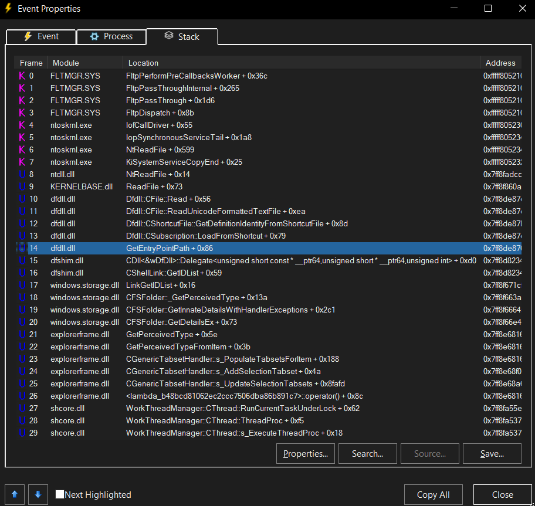
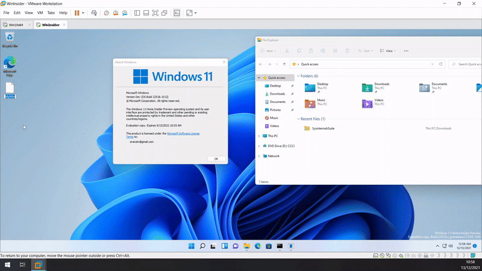

# How I Found My First CVEs in Windows

My name is Eran Zimmerman Gonen. I am 33 years old, and it has always been my dream to find a CVE of my own. This is how I did it.

I played around with some ideas, aiming nowhere in particular, and I had SysInternals' [Process Monitor (procmon)](https://learn.microsoft.com/en-us/sysinternals/downloads/procmon) running in the background. This is a good practice for anyone trying to see what's going on behind the scenes on your computer (and there's plenty of that), and I was hoping to find some strange or possibly vulnerable behavior. One such class of behavior is parsing. Parsing basically means that a process is reading a file, and does something based on its contents. This can be displaying an image, playing audio or video, rendering a web page or an Office document, running an executable file, etc.
I was lucky enough that in my research playground folder I had a file with the .appref-ms file extension, probably from some previous research attempt. When I opened the folder, I saw events in procmon saying that the file was opened and read.

In this screenshot from procmon, There is a CreateFile event (the name is confusing - CreateFile is used both for creating files and for opening existing files), and later a ReadFile event. If we double-click the ReadFile event and go to the Stack tab (assuming symbols were properly configured in procmon, which allows for the actual function names to appear), we can see which function called ReadFile. Once we have that, we can build a harness and start [fuzzing](https://en.wikipedia.org/wiki/Fuzzing).

A harness is a tiny program (as small as possible), that does little more than call the function we suspect may be vulnerable (i.e. the parsing function). It is naturally also responsible for preparing the input to this function and dealing with its output (sometimes these are trivial phases, sometimes they're more complex). I chose to use [WinAFL](https://github.com/googleprojectzero/winafl) for fuzzing. This is a Windows port of the famous AFL fuzzer, which is a coverage-guided fuzzer (which roughly means that it doesn't just blindly try to throw random inputs at the target, but rather try to guess inputs which will cause the program to run through different execution paths and thus greatly increase chances of finding a crash).

Looking at the stack of the call to ReadFile, we try to find the lowest function in the call chain that does the parsing on the input. Taking a higher function isn't necessarily wrong, but could cause each fuzz attempt to take longer, thus increasing the mean time to find crashes. Taking a lower function might read the file but not do anything interesting with the data (no parsing), which will mean we won't find any crashes.
At this point, it's worth mentioning that the appref-ms file extension is (according to [fileinfo.com](https://fileinfo.com/extension/appref-ms)): Application reference file used by ClickOnce, a Microsoft platform used to deploy and run remote Web applications; contains a local or remote link to an application; commonly used to enable links from the Windows Start Menu. So indeed, it is a type of shortcut (its icon also shows the little arrow that also exists for normal .lnk shortcut files).

In this case, I chose the GetEntryPointPath function (frame 14 in the image), for several reasons (though by no means is it the only good option or even the best option):
1. First, it does what we expect - calls ReadFile (frame 9 in the image above).
2. You can see some interesting function names in the call chain under GetEntryPointPath which hint it may be parsing that file (such as GetEntryPointPath itself, LoadFromShortcut, GetDefinitionIdentityFromShortcutFile) or making some assumptions on the file's format (such as ReadUnicodeFormattedTextFile).
3. The function is exported from its dll (dfdll.dll) - definitely not a requirement, but it's slightly more convenient. This allows easily getting its address using GetProcAddress function, and *usually* means there isn't any internal state or objects you have to worry about setting/creating.
4. It's a C function and not a C++ function (shouldn't be too complicated to fuzz C++ functions, but it takes a little more effort, since you have to first take care of initializing the relevant object - which may sometimes be difficult for internal structures when you don't have the source code).
5. The file path was easy to control - it was simply a parameter given to the function.

I built a tiny harness that calls GetEntryPointPath, giving it the path to the fuzzer-generated input file as a parameter, and put the fuzzer to the work.
After not too long, I got a single hang. In my short fuzzing experience, we usually want crashes, and hangs are usually false positives - or at least nothing we'd be able to get anything interesting from. Since after running for a while and getting nothing I had nothing else to go with, I opted to try it. Apparently, it wasn't a hang at all - but indeed a crash. The file caused an exception to be raised inside clr.dll (also a .NET dll, used by dfdll.dll), wasn't caught - and thus the process crashed.

This might be a good time to mention two useful tools that come with winafl - tmin (afl-tmin.exe) and cmin (winafl-cmin.py). Please see the Performance section (under "Lessons Learned") to understand why they're useful. cmin is a corpus minimization tool. It can take a bunch of inputs, and try to see if any of them are redundant. If the program takes the same path of execution on two of them - there's no reason to keep both, and we can decide which of the two to keep (e.g. the smaller one). tmin is a test case minimizer. It tries to take away or nullify parts of an input, without changing the program's execution path for it. This could, for example, be used for getting a smaller file that causes a crash, or make seed input files smaller (as an input for the fuzzing process).

With a combination of tmin and manual minification of the file, I managed to arrive at a minimal file of 8 characters (8 bytes) that triggers the crash.
Playing around with fuzzing and minification, I managed to get a total of eight inputs that cause distinct crashes (i.e. they crash in different points in the code), however - their root cause is the same, so Microsoft deemed them as duplicates.

To verify the findings, I put the crashing file in a folder and renamed it to have a .appref-ms extension. Immediately, explorer.exe read the file and crashed, closing all the windows with it. Tried going into that folder again, and explorer.exe crashed again. I wondered what would happen if I would put it on the desktop. I had a cmd open at the ready so I would be able to delete or rename the file. Indeed, the file was immediately detected by explorer.exe and it crashed, but since the desktop is always open - explorer.exe didn't manage to load back and already it crashed again, and then again, and so forth. See [Demo video](static/DoS_PoC_Win11.mkv). <!-- Demo video:  - TODO check this first: https://www.geeksforgeeks.org/how-to-add-videos-on-readme-md-file-in-a-github-repository/ -->

Later, I managed to find an additional bad input. I found this when fuzzing with Page Heap turned on. Page Heap can be turned on in various ways ([Application Verifier (appverif)](https://learn.microsoft.com/en-us/windows-hardware/drivers/devtest/application-verifier), [gflags](https://learn.microsoft.com/en-us/windows-hardware/drivers/debugger/gflags-and-pageheap), direct registry modification, etc.). When Page Heap is enabled for a process, each heap allocation in that process allocates guard pages before and after the allocation page(s), with no access allowed (among other things). This means that trying to access them will cause a crash - which will happen if we overflow. This is a mechanism designed to help find memory bugs. The process will run slower and consume considerably more memory. In my case I managed to find a hidden memory corruption bug, which after looking into I could tell was a Use-After-Free (UAF) bug. This bug didn't reproduce without Page Heap. This UAF could lead to Remote Code Execution (RCE).

## Attack Vectors
These are some possible attack vectors for the DoS vulnerability, similar vectors are possible for the RCE vulnerability.
An attacker may trick the user (e.g. social engineering / phishing) into downloading the malicious file (with .appref-ms extension) to their desktop, or alternatively do it themselves with no user interaction if the attacker already has the ability of remotely creating files in the victim machine (e.g. a shell / network share / file server open to file uploads).

1. Attacker may place the file in a target folder, e.g. one that contains malicious files, in order to prevent browsing this folder. The target folder may also be a "common" folder, such as "Downloads", which has a relatively high chance of being opened (directly with Windows Explorer or through a browse window).
2. Attacker may place the file in Quick Access / Recent Files, which will crash explorer.exe whenever a new window is opened, and other processes when opening a browse window.
3. Attacker may place the file on the desktop. This will cause explorer.exe to constantly reboot itself (reboot loop), rendering the computer unusable.
4. Attacker may do this over a network as well, assuming he can write a file remotely somehow (by himself or by tricking the user to do so). For social engineering, all the attacker needs to do is convince the victim to download the file (no need to double-click it later)
5. Attacker may do a drive-by attack, setting up a website that when browsed will download the malicious file to the victim's Downloads folder, causing explorer.exe to crash whenever the victim tries to open the Downloads folder, which would also prevent users from being able to download anti virus software, etc.

## Next Steps
I tried to replicate my success for other file extensions as well. I thought - how can I get files with all file extensions? In the past, file extensions used to be mostly 3 characters, but today you can find shorter and longer extensions (e.g. appref-ms, 7z, application, sh, and many others). Creating files with all possible extensions seemed to be an impractical idea (would need over 10^18 files). But what are the "suspect" extensions? What would actually have chances of success? It then hit me - the registry holds under HKCR keys for all extensions that have any sort of "special behavior" - from default programs to open them, are they types of shortcuts, custom context menu entries, content type and more. This should be a good place to start looking. Using python, I quickly extracted all the extensions in HKCR (all the key names starting with a dot), and created a file for each extension with 1 byte inside them (in case empty files are ignored or something), and put them all in a folder - got a little over 500 files, a reasonable amount. I opened their containing folder while procmon was recording, hoping to get more hits. I got a small amount (one of which was the same one we already knew about - appref-ms), but unfortunately the other stack traces didn't look interesting, and also they weren't consistent, i.e. closing the folder and opening it again didn't reproduce those events (and I tried multiple times).

It would've probably been a good idea to try and test the finding further - where else does it trigger? File previews? SMB share? As an e-mail attachment? And so on. However, in this case I had some other work and never got around to it.

## Lessons Learned
### Self-Learning
This was more or less my first "real" fuzzing experience. I knew quite a lot about the theory of fuzzing, but I barely did it myself beforehand. I was glad to see that I could self-learn this subject to the level where I achieve results, and in a very short time period.
Never be afraid to use all the resources at hand (the internet is big. People have usually done it before you and wrote about it) and learn by yourself, even if your journey would be harder and slower. It's worth it.

### Performance
Since I had no one to guide me, I made some rookie mistakes. My fuzzing was initially extremely slow, and I was a bit frustrated. I started to think that that's the way it is, or maybe the target function I'm fuzzing simply takes a long time to run. However, I examined the fuzzing with several tools (procmon, profilers, common sense) and step-by-step found more and more mistakes I made, each time increasing fuzzing speed a little (or a lot) more. Here are some lessons I learned the hard way, regarding how to speed up fuzzing (fuzzing is all about speed - the faster everything runs, the faster you can find crashes, or decide to look somewhere else. And we're not talking about minutes or even hours difference - we're talking days or even larger differences), in this and in similar research projects I undertook in relatively close time proximity.
1. Make sure inputs to the fuzzer are small, and don't overlap (no redundancy). Similar inputs are either not interesting, or otherwise the fuzzer may find those itself. Big or redundant inputs increase the time it takes the fuzzer either for a single run or for a single cycle.
2. Make sure AV is disabled, and so are any software that may monitor file creation. For me, the AV scanned each input file the fuzzer created, which caused each run to take way longer than it should have. In another case, I fuzzed a file which was inside a git repository (for no good reason), and I had TortoiseGit on that computer. TGitCache process runs code for each file creation or deletion inside the repository - which quickly spiked my CPU usage to 100% and slowed down everything.
3. My setup is a simple computer or virtual machine, not an expensive fuzzing rig with dedicated software. Doesn't hurt to disable any non-necessary software or features (such as automatic Windows update, background processes and services, scheduled tasks, indexing, logging, etc.), adjust power options for best performance, increase the fuzzer process's priority, etc.
4. Run fuzzer in parallel on multiple CPU cores (turns out it's much simpler to do than I initially thought)
5. Using [Application Verifier (appverif)](https://learn.microsoft.com/en-us/windows-hardware/drivers/devtest/application-verifier) can help find memory (and other) errors. Turns out it creates logs on each run, and names them with an incrementing index. This means that after 2000 runs, it will try, upon process creation (suspending the process in this time), to open all first 2000 names, only to succeed on the 2001st. For 65K files, this took me about 20 seconds per run. In many cases (e.g. when all you want is to enable PageHeap), you can use gflags instead, which doesn't write logs on process creation, or alternatively, run `appverif -logtofile disable` which disables logging.
6. Often, the bottleneck in fuzzing (when otherwise done correctly) is the disk I/O - for each run the fuzzer needs to write a file to the disk which is the input to the target function. The disk is very slow relative to the memory, and therefore slows us down. One option that may be considered (has pros and cons) is to use RAMFS - this means that part of the RAM is mounted as a partition, i.e. you'll get a new drive that the files on it are in fact saved in the memory, not on the disk. This also means that on every computer restart / crash, anything in there will vanish. Another option to reduce disk I/O is to use a shared memory buffer instead of a file on the disk. The fuzzer can change the contents of that buffer, and the target program will take the data from that buffer instead of a file (if possible). This should also reduce disk I/O and thus improve performance.
7. Automate as much as possible. Fuzzing involves doing the same things many times (e.g. run the fuzzer on every computer restart). Automations won't make the fuzzer itself run faster, but it will help you get faster results, as things will depend less on a human operator to do some things.

### Community
WinAFL is an open-source project hosted on github, as are many other projects and tools you'd probably use during your research. Whenever I saw something in WinAFL that either bothered me or that I thought could be improved, I either opened an issue for it or went straight on and coded it and submitted a pull request. This can be anything from fixing typos and grammatical errors, through fixing simple compilation or static analysis warnings, and even big performance or functional changes. Just make sure you're in accordance with the repo owner and the contributing rules. Start with small fixes, they will allow you better understanding of the code and give you confidence to make bigger changes.

## Results

### CVE-2022-30130
Denial-of-Service in .Net, affects Windows 7-11 (server editions 2008-2022), .Net versions 2-4.8.
[https://msrc.microsoft.com/update-guide/en-US/vulnerability/CVE-2022-30130](https://msrc.microsoft.com/update-guide/en-US/vulnerability/CVE-2022-30130)
Patched on May 2022.

### CVE-2022-26929
Remote Code Execution in .Net, affects Windows 7-11 (server editions 2008-2022), .Net versions 2-4.8.1.
[https://msrc.microsoft.com/update-guide/en-US/vulnerability/CVE-2022-26929](https://msrc.microsoft.com/update-guide/en-US/vulnerability/CVE-2022-26929)
Patched on September 2022.
I was awarded a bounty for this vulnerability report.

## Feedback
I would really appreciate any feedback, good or bad, on this. This is my first real post, as well as (in some aspects) the beginning of a journey for me. Did you find the post helpful or interesting? Is there something you think should be fixed or I got wrong? Would you do something differently in your research method? Please feel free to contact me here or on twitter ([@3r4nz](https://twitter.com/3r4nz))!

